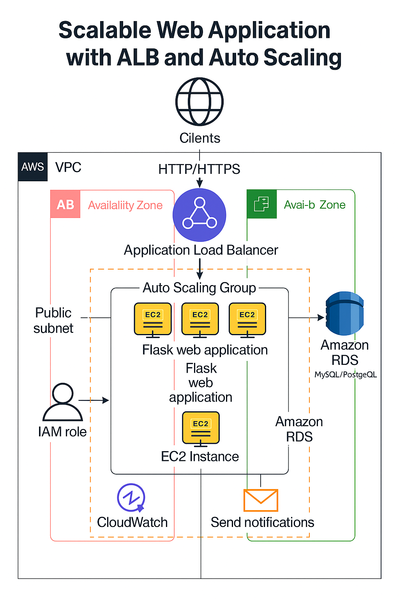

# Scalable Web Application with ALB and Auto Scaling

This project demonstrates how to deploy a scalable, secure, and cost-optimized web application on AWS using **Terraform**. It provisions three Flask web applications across EC2 instances, fronted by an Application Load Balancer (ALB), and uses Auto Scaling Groups (ASG) to ensure high availability and elasticity. A MySQL database is hosted in Amazon RDS, and CloudWatch with SNS handles monitoring and alerts.

---

## 📌 Solution Architecture Diagram



---

## 🚀 Features

- ✅ Three Flask web apps running on Amazon EC2 instances
- ✅ Application Load Balancer (ALB) for distributing traffic
- ✅ Auto Scaling Group (ASG) for scalability
- ✅ Amazon RDS (MySQL) for backend database
- ✅ IAM roles for secure access
- ✅ CloudWatch metrics and SNS for notifications
- ✅ Fully infrastructure-as-code using Terraform

---

## 📁 Project Structure

scalable-web-app-alb-asg/
├── app/
│ └── app.py # Flask app source
│ └── requirements.txt # Python dependencies
│ └── Dockerfile # Container setup
├── terraform/
│ ├── main.tf # Main Terraform config
│ ├── variables.tf # Input variables
│ ├── outputs.tf # Outputs
│ ├── versions.tf # Provider versions
│ └── modules/ # Reusable Terraform modules
├── diagrams/
│ └── scalable-web-app-architecture.png
├── .gitignore
├── README.md
└── LICENSE


---

## 🛠 How to Deploy (Terraform)

> ⚠️ Requires an AWS account with programmatic access

1. **Install Terraform**  
   https://developer.hashicorp.com/terraform/downloads

2. **Clone the Repo**
   ```bash
   git clone https://github.com/MahmoudMoawadAbdelhamid/scalable-web-app-alb-asg.git
   cd scalable-web-app-alb-asg/terraform

3. Configure AWS CLI (if not already)
aws configure

4. Initialize Terraform
terraform init

5. Review the Plan
terraform plan

6. Apply Infrastructure
terraform apply

🧼 Cleanup
To delete the infrastructure:
terraform destroy

📄 License
This project is licensed under the MIT License.
